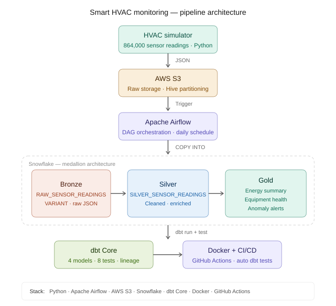

# Smart HVAC Monitoring & Energy Optimization

## Overview

A production-style, end-to-end data pipeline that simulates real-world HVAC sensor monitoring across **5 commercial buildings in the UAE/Middle East** — processing **864,000 sensor readings** through a Bronze/Silver/Gold medallion architecture into business-ready analytical tables.

Built to demonstrate practical Data Engineering skills across the full stack: data simulation, cloud storage, warehouse design, transformation, data quality testing, orchestration, containerization, and CI/CD automation.

---

## Architecture

---

## Tech Stack

| Layer | Tool | Purpose |
|---|---|---|
| Simulation | Python 3.11 | Generate realistic HVAC sensor data |
| Storage | AWS S3 | Raw data lake with Hive partitioning |
| Orchestration | Apache Airflow 2.x | Daily pipeline scheduling and monitoring |
| Warehouse | Snowflake | Bronze/Silver/Gold medallion architecture |
| Transformation | dbt Core 1.8 | Incremental models, tests, and lineage |
| Containerization | Docker | Reproducible pipeline environment |
| CI/CD | GitHub Actions | Automated dbt tests on every code push |

---

## Data Pipeline

### Simulation Layer

The HVAC simulator generates sensor data for 5 commercial buildings across UAE/Middle East cities (Dubai, Abu Dhabi, Doha, Riyadh, Sharjah). Each reading captures:

- Temperature, humidity, CO2 levels
- Energy consumption (kWh)
- Compressor and fan status
- Equipment health scores
- Anomaly flags

**Total records:** 864,000 readings across 30 days

### Storage Layer — AWS S3

Raw JSON records are uploaded to S3 with Hive-style date partitioning:

s3://hvac-raw-data-devesh/
  year=2026/
    month=01/
      day=01/
        hvac_data_20260101.json

### Orchestration Layer — Apache Airflow

A single DAG orchestrates the full pipeline on a daily schedule:

simulate_data → upload_to_s3 → load_to_snowflake → run_dbt → test_dbt

Each task only starts if the previous one succeeds.

### Warehouse Layer — Snowflake

Three-layer medallion architecture inside `HVAC_DB`:

**Bronze** — Raw ingestion via COPY INTO. VARIANT column stores JSON exactly as received. Clustered on `READING_DATE` for partition pruning.

**Silver** — Cleaned and enriched readings. Incremental dbt model processes only new records on each run. Joins building and equipment dimension tables.

**Gold** — Three analytical tables:
- `gold_building_energy_summary` — daily energy KPIs per building
- `gold_equipment_health` — equipment scoring and maintenance flags
- `gold_anomaly_alerts` — flagged readings outside normal thresholds

### Transformation Layer — dbt Core

- 4 models (1 Silver incremental + 3 Gold)
- 8 data quality tests (unique, not_null, accepted_values)
- Full lineage graph generated via `dbt docs`
- Sources defined for Bronze tables and reference dimensions

---

## Project Structure

hvac-data-platform/
├── .github/
│   └── workflows/
│       └── dbt_tests.yml        ← GitHub Actions CI/CD
├── airflow/
│   └── dags/
│       └── hvac_pipeline_dag.py ← Airflow DAG
├── config/
│   ├── settings.py              ← Environment config
│   └── constants.py             ← Business thresholds
├── dbt_hvac/
│   ├── models/
│   │   ├── silver/
│   │   └── gold/
│   ├── schema.yml               ← dbt tests
│   └── dbt_project.yml
├── ingestion/
│   └── s3_client.py             ← S3 upload logic
├── simulator/
│   └── hvac_simulator.py        ← Data generation
├── docs/
│   └── architecture.svg         ← Pipeline diagram
├── Dockerfile
├── .dockerignore
├── requirements.txt
└── README.md

---

## CI/CD

Every push to `main` automatically triggers a GitHub Actions workflow that:

1. Spins up a clean Ubuntu environment
2. Installs dbt-core and dbt-snowflake
3. Creates a `profiles.yml` from GitHub Secrets
4. Runs `dbt test` against the Snowflake warehouse
5. Reports pass/fail on the commit

This ensures no breaking changes reach the main branch without data quality tests passing first.

---

## Domain Context

HVAC systems account for 60–70% of total energy consumption in commercial buildings. The sensor thresholds, anomaly detection logic, and energy KPIs in this project reflect real parameters used in commercial building management — informed by domain experience working with HVAC systems in the Middle East market.

---

## Roadmap

- [x] Phase 1 — Data simulation + AWS S3 raw storage
- [x] Phase 2 — Snowflake Bronze/Silver/Gold + dbt models and tests
- [x] Phase 3 — Apache Airflow orchestration DAG
- [x] Phase 4 — Docker containerization + GitHub Actions CI/CD

---

## Author

**Devesh Jakhar**  
Application Data Engineer → Data Engineer
